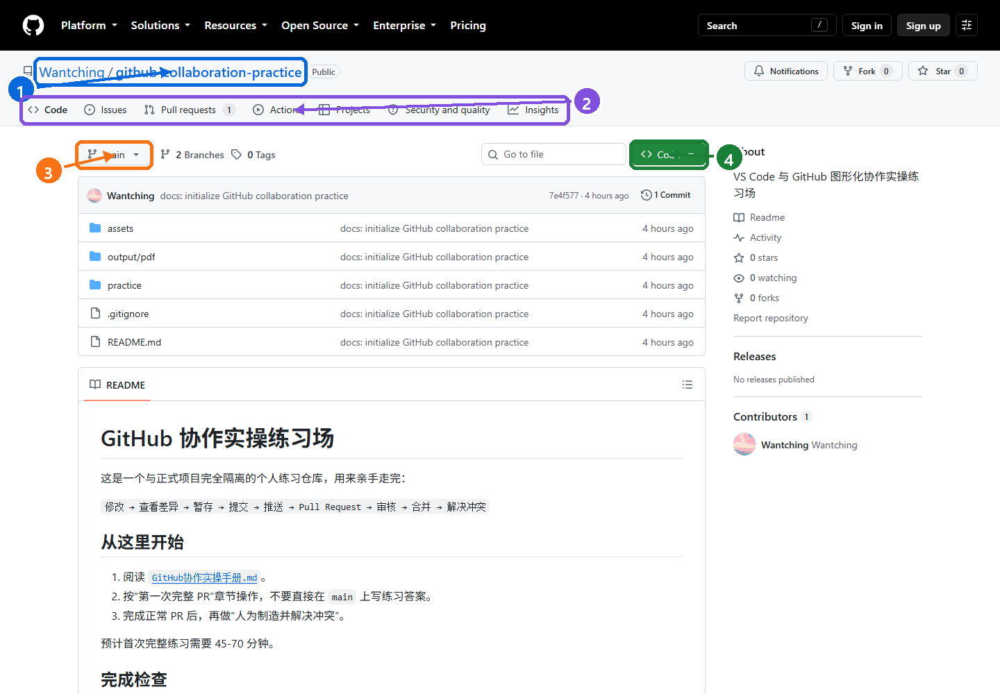
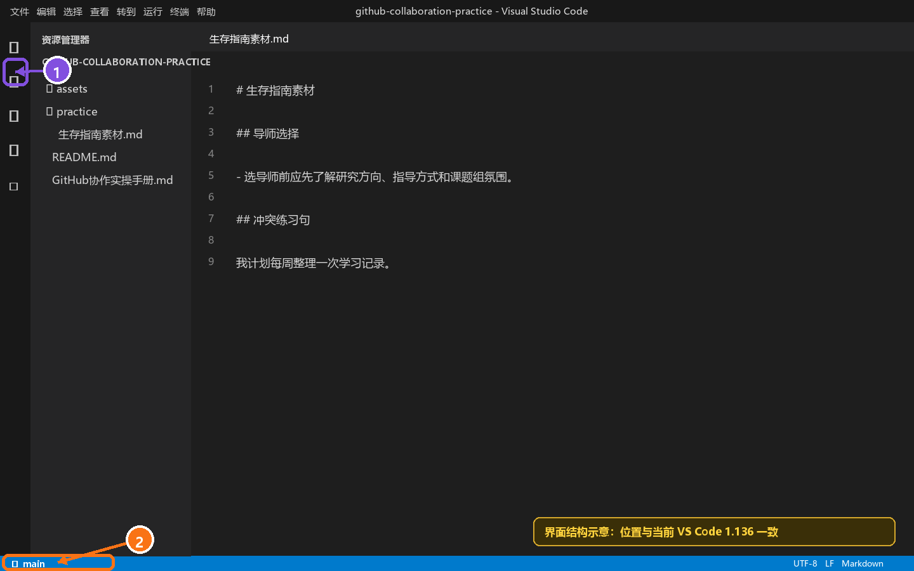
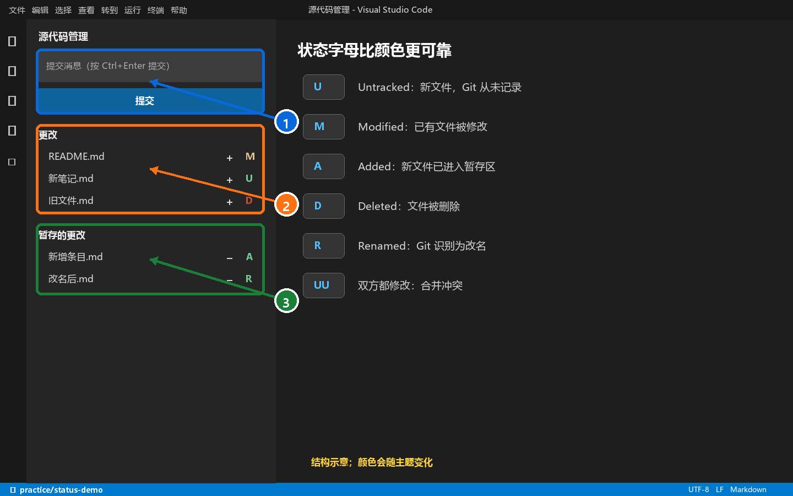
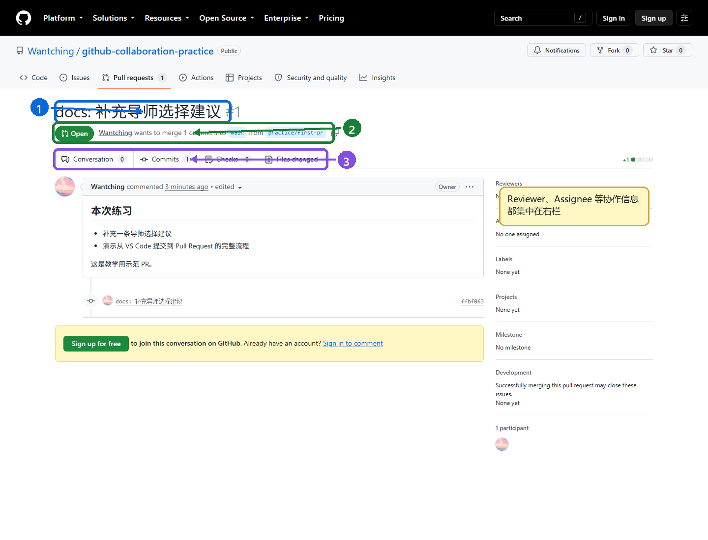
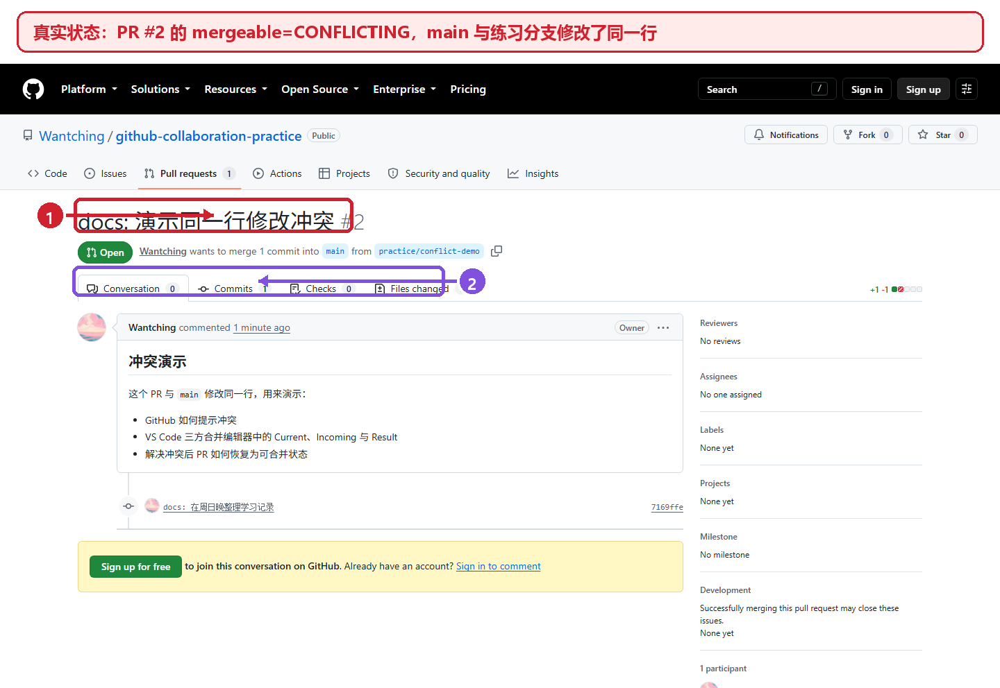
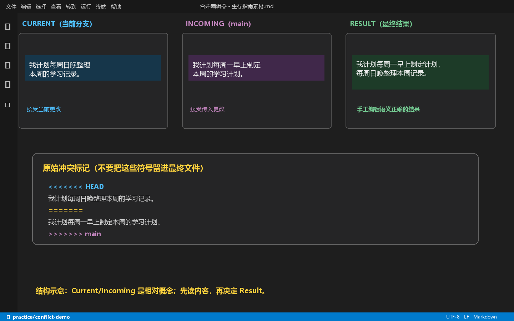
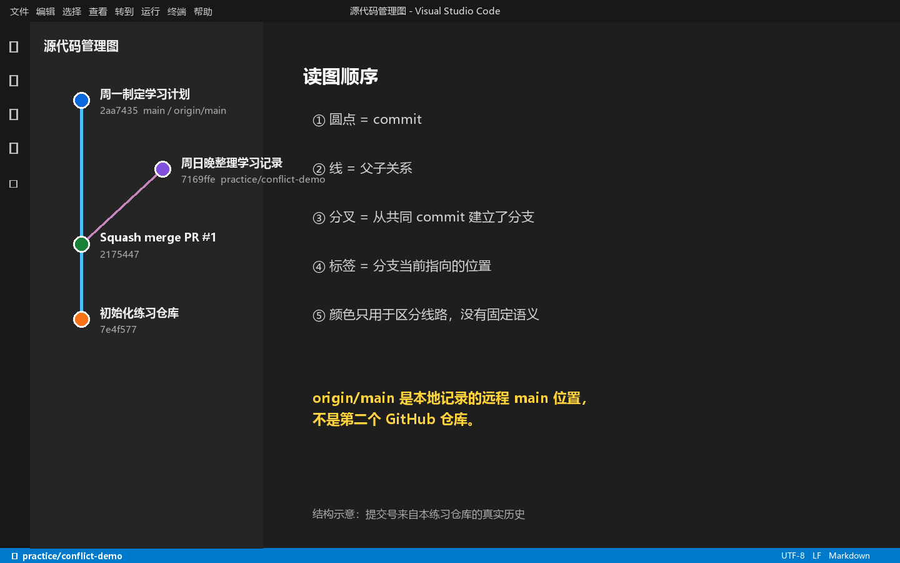

# VS Code + GitHub 图形化协作实操手册

> 面向第一次真正参与 GitHub 协作的同学。以 VS Code 图形界面为主，每一步都附等价命令，方便你把按钮与 Git 概念联系起来。

仓库：[`Wantching/github-collaboration-practice`](https://github.com/Wantching/github-collaboration-practice)  
示范 PR：[正常 PR #1](https://github.com/Wantching/github-collaboration-practice/pull/1) · [冲突 PR #2](https://github.com/Wantching/github-collaboration-practice/pull/2)

## 阅读方法

先完整做第 4 章的正常 PR，再做第 5 章的冲突练习。第一次不要追求记住按钮；每做一步，都回答两个问题：

1. 变化现在位于工作区、暂存区、本地仓库，还是 GitHub？
2. 我当前站在哪个分支上？

> 截图说明：GitHub 图片取自本练习仓库的真实页面。当前自动化环境无法可靠截取原生 VS Code 窗口，因此 VS Code 图片是依据当前 1.136 版布局制作的**界面结构示意图**，已在图中明确标注；菜单名和操作路径按当前官方文档核对。

---

## 1. 一张图理解整套流程

```text
电脑上的文件
    │ 保存
    ▼
Working Tree 工作区       ← VS Code 的“更改 / Changes”
    │ Stage（点 +）
    ▼
Staging Area 暂存区       ← “暂存的更改 / Staged Changes”
    │ Commit
    ▼
本地 Git 历史             ← GitHub 仍然看不到
    │ Push / Publish Branch
    ▼
GitHub 上的个人分支
    │ Pull Request
    ▼
Review → Merge
    │
    ▼
GitHub 的 main
```

三个最容易混淆的动作：

| 动作 | 做了什么 | 有没有到 GitHub |
|---|---|---|
| 保存 Save | 把编辑器内容写到电脑文件 | 没有 |
| 提交 Commit | 把暂存内容保存进本地 Git 历史 | 没有 |
| 推送 Push | 把本地 commit 上传到远程分支 | 有 |

### 1.1 `main`、`origin/main` 与 `HEAD`

- `main`：电脑上的本地 `main` 分支。
- `origin`：远程仓库的默认昵称，本练习中指 GitHub 仓库。
- `origin/main`：你电脑最近一次获知的 GitHub `main` 所在位置。
- `HEAD`：你现在所在的位置，通常指向当前分支。

把它想成：`HEAD` 是“你站在哪里”的箭头；分支名是“贴在某个 commit 上的标签”。创建分支不是复制整份项目，只是多建一个很轻的标签。

---

## 2. 准备环境与认识仓库首页

### 2.1 克隆练习仓库

本机已验证 SSH 可用。远程地址必须是：

```text
git@github.com:Wantching/github-collaboration-practice.git
```

VS Code 中按 `Ctrl+Shift+P`，依次操作：

1. 输入并选择 `Git: Clone` / `Git: 克隆`。
2. 粘贴上面的 SSH 地址。
3. 选择父目录；VS Code 会新建 `github-collaboration-practice` 文件夹。
4. 克隆结束后选择“打开”。

等价命令：

```bash
git clone git@github.com:Wantching/github-collaboration-practice.git
```

如果已经打开本手册所在的本地仓库，不要再次克隆。

### 2.2 GitHub 仓库首页



图中编号：

1. **仓库所有者 / 仓库名**：`Wantching/github-collaboration-practice`；右侧 `Public` 表示公开可见。
2. **功能页签**：`Code` 看文件，`Issues` 记任务，`Pull requests` 提交和审核修改，`Actions` 运行自动化。
3. **分支选择器**：图中是正式版本 `main`；点击可切换查看其他远程分支。
4. **Code 按钮**：复制 HTTPS/SSH 地址、下载 ZIP 或在其他工具中打开。日常协作请选择 SSH。

### 2.3 VS Code 的主要区域



1. 左侧活动栏的分支状图标是 **Source Control / 源代码管理**，快捷键 `Ctrl+Shift+G`。
2. 左下角显示当前分支。动手前先看这里，确认不是误站在 `main` 上。

左侧资源管理器只是文件视图；Source Control 才显示 Git 发现的变化。文件保存后，变化才会稳定地出现在 Source Control 中。

---

## 3. 文件状态、颜色、Diff 与暂存区



1. 顶部输入框写 commit message；“提交”只建立本地 commit。
2. **更改**中的文件尚未暂存。悬停文件后出现 `+`，表示 Stage Changes。
3. **暂存的更改**会进入下一次 commit。悬停后 `-` 表示 Unstage，不会删除文件内容。

### 3.1 必须认识的状态字母

| 状态 | 英文 | 准确含义 | 常见颜色 |
|---|---|---|---|
| `U` | Untracked | 新文件，Git 从未记录 | 绿色 |
| `M` | Modified | 已跟踪文件被修改 | 黄/橙色 |
| `A` | Added | 新文件已经进入暂存区 | 绿色 |
| `D` | Deleted | 已跟踪文件被删除 | 红色 |
| `R` | Renamed | Git 将变化识别为改名 | 蓝/绿色 |
| `UU` | Unmerged | 双方都修改，尚未解决冲突 | 红色 |

颜色取决于 VS Code 主题，因此不要背“黄色一定是什么”。优先认字母、文件所在分组和 diff 内容。

### 3.2 编辑器左侧的小色条

- 绿色：相对于上一次 commit 新增了行。
- 蓝色：已有行被修改。
- 红色三角：这里删除过内容。

它与资源管理器中文件名的颜色不是同一层含义。点击色条可以预览对应 diff。

### 3.3 五分钟状态练习

在新的练习分支上完成，不要提交这些临时变化：

1. 从 `main` 创建 `practice/status-yourname`。
2. 修改 `README.md`，看到 `M`。
3. 新建 `practice/临时笔记.md`，看到 `U`。
4. 点击新文件右侧的 `+`，它进入“暂存的更改”，状态成为 `A`。
5. 点击暂存文件右侧的 `-`，它返回“更改”，重新成为 `U`。
6. 右键临时文件选择“放弃更改”前先停一下：这是会丢内容的动作。只对这份明确不要的临时文件执行。
7. 将 `README.md` 的修改改回原样，Source Control 应恢复干净。

> `Discard Changes / 放弃更改` 与 `Unstage / 取消暂存` 完全不同：前者丢弃内容，后者只把内容从下一次 commit 的清单中拿出来。

### 3.4 Commit 前必须看 diff

点击“更改”中的文件，会打开 diff：左侧是上次提交的版本，右侧是当前版本；窄窗口可能改成单栏显示。

```diff
- 原来的句子
+ 修改后的句子
```

提交前逐文件检查：是否混入了无关修改、昵称是否署名、是否误删段落、是否泄露隐私。

---

## 4. 第一次完整 Pull Request

下面使用 `practice/my-first-pr`。示范结果可查看已合并的 [PR #1](https://github.com/Wantching/github-collaboration-practice/pull/1)。

### 4.1 开工前更新 `main`

1. 点击 VS Code 左下角分支名，切换到 `main`。
2. 打开 Source Control，点击 `...` → `拉取、推送` → `拉取`；也可以使用状态栏的同步按钮。
3. Source Control 应无未提交文件。

等价命令：

```bash
git switch main
git pull --ff-only origin main
```

如果 `main` 上还有未提交变化，先处理它们，不要急着切分支或 Pull。

### 4.2 创建任务分支

1. 点击左下角 `main`。
2. 选择“创建新分支”。
3. 输入 `practice/my-first-pr`，按 Enter。
4. 再看左下角，必须显示新分支名。

等价命令：

```bash
git switch -c practice/my-first-pr
```

分支命名建议：`content/章节-主题`、`fix/问题`、`docs/文档名`。不要使用“new”“test2”这类无法判断用途的名字。

### 4.3 修改、Diff、Stage、Commit

打开 `practice/生存指南素材.md`，在“导师选择”下新增一条你自己的练习内容，例如：

```markdown
- 选导师前可以和课题组在读学生聊聊真实的指导节奏。 ——你的昵称
```

然后：

1. `Ctrl+S` 保存。
2. `Ctrl+Shift+G` 打开 Source Control。
3. 点击文件名查看 diff。
4. 确认只有预期的一行后，点击文件右侧 `+`。
5. 为理解暂存区，可先点 `-` 取消暂存，再点 `+` 重新暂存。
6. 在顶部输入 `docs: 补充导师选择建议`。
7. 点击“提交”。

等价命令：

```bash
git add "practice/生存指南素材.md"
git commit -m "docs: 补充导师选择建议"
```

Commit 后文件从列表消失，说明工作区相对这个新 commit 已干净；不代表 GitHub 已收到它。

### 4.4 Publish Branch / Push

新分支第一次推送时，VS Code 通常显示 **Publish Branch / 发布分支**。点击后，本地分支与 GitHub 上的同名分支建立跟踪关系。

```bash
git push -u origin practice/my-first-pr
```

以后继续修改该分支，只需普通 Push：

```bash
git push
```

状态栏出现 `↑1` 表示有一个本地 commit 尚未推送；`↓2` 表示远程有两个 commit 尚未拉取。

### 4.5 在 GitHub 创建 PR

打开仓库网页。GitHub 通常出现 `Compare & pull request`；也可以进入 `Pull requests` → `New pull request`。



1. PR 标题应说明“改了什么”，不是写“更新”“提交一下”。
2. `base: main ← compare: practice/my-first-pr` 表示请求把右边分支的变化合入左边。
3. `Conversation / Commits / Checks / Files changed` 分别展示讨论、提交、检查和最终 diff。

推荐填写：

```markdown
标题：docs: 补充导师选择建议

## 修改内容
- 新增一条导师选择经验
- 已按“一句话 + 署名”格式检查

## 自检
- [x] 只修改了对应章节
- [x] 已阅读 Files changed
```

点击 `Create pull request` 后，PR 才真正创建。PR 不是上传文件的按钮，而是“请求把一个分支合到另一个分支”。

### 4.6 PR 提出后继续修改

如果 Review 说“请补署名”：

1. 回到 VS Code，确认仍在 `practice/my-first-pr`。
2. 修改、保存、查看 diff、Stage、Commit。
3. Push。

原 PR 会自动增加新 commit，不要再开第二个 PR。

### 4.7 Review、Squash merge 与收尾

在 GitHub 的 `Files changed` 中逐行检查。核心协作者可以：

- `Comment`：只留言，不表态是否可合并。
- `Approve`：同意合并。
- `Request changes`：要求先修改。

本练习只有自己的账号，可以进行自检后选择 `Squash and merge`。Squash 会把分支上的多个小 commit 压成 `main` 上的一个整洁 commit。

合并后点击 `Delete branch` 删除远程临时分支；再回 VS Code：

```bash
git switch main
git pull --ff-only origin main
git branch -d practice/my-first-pr
git fetch --prune
```

图形界面中可以在分支选择器或 Source Control Graph 的右键菜单删除已合并的本地分支。

---

## 5. 人为制造并解决一次冲突

冲突不是 Git 坏了，而是 Git 不知道同一处的两个版本哪一个才是人的真实意图。本仓库的 [PR #2](https://github.com/Wantching/github-collaboration-practice/pull/2) 已真实走过一次从 `CONFLICTING` 到 `MERGEABLE` 的过程。

### 5.1 制造冲突

1. 更新 `main`，创建 `practice/my-conflict-demo`。
2. 在分支中把“冲突练习句”改为：

   ```text
   我计划每周日晚整理本周的学习记录。
   ```

3. Stage、Commit、Publish Branch，并创建一个到 `main` 的 PR。
4. 保持 PR 暂不合并。在 GitHub `main` 上打开同一文件，点击铅笔图标编辑，把同一句改为：

   ```text
   我计划每周一早上制定本周的学习计划。
   ```

5. 将网页修改直接提交到 `main`。回到 PR 并刷新，GitHub 会计算出冲突，合并按钮不可用。



图中：

1. `main` 和 `practice/conflict-demo` 来自同一基点，但各自修改了同一行。
2. 示例 PR 的说明保留了这次冲突的目的；后台实际状态经 GitHub 确认为 `mergeable=CONFLICTING`。

### 5.2 把最新 `main` 合进练习分支

先在 VS Code 切到 `main` 并 Pull，再切回练习分支：

```bash
git switch main
git pull --ff-only origin main
git switch practice/my-conflict-demo
git merge main
```

图形界面对应：

1. 左下角切换 `main`，Source Control `...` → Pull。
2. 切回 `practice/my-conflict-demo`。
3. `Ctrl+Shift+P`，运行 `Git: Merge Branch...` / `Git: 合并分支...`。
4. 选择 `main`。

此时文件会显示 `UU`，Source Control 将它列入“合并更改”。

### 5.3 三方合并编辑器怎么读



在“合并更改”中点击冲突文件；若只看到原始标记，右键文件选择“在合并编辑器中打开”。当你在 feature branch 上执行 `git merge main` 时：

- **Current / 当前**：当前 feature branch 的版本，即周日晚整理记录。
- **Incoming / 传入**：正在合入的 `main` 版本，即周一制定计划。
- **Result / 结果**：最终要保存并提交的文本。

不要机械点 `Accept Both`。两句话可能重复、矛盾或语法不通。先理解意思，再把 Result 手工整理为：

```text
我计划每周一早上制定本周计划，每周日晚整理学习记录。
```

原始文本模式会看到：

```text
<<<<<<< HEAD
我计划每周日晚整理本周的学习记录。
=======
我计划每周一早上制定本周的学习计划。
>>>>>>> main
```

`<<<<<<<`、`=======`、`>>>>>>>` 都是 Git 的冲突标记，最终文件中必须全部删除。

### 5.4 标记解决、提交并推送

1. 检查 Result，保存文件。
2. 点击冲突文件右侧 `+`，表示“我确认这个文件已经解决”。
3. 输入 `merge: 解决学习计划冲突`，完成 merge commit。
4. Push。
5. 刷新 GitHub PR，状态应恢复为可合并。
6. 完成自检、Squash merge、删除远程分支。

等价命令：

```bash
git add "practice/生存指南素材.md"
git commit -m "merge: 解决学习计划冲突"
git push
```

如果你不想继续这次合并，可在**尚未提交合并结果时**运行：

```bash
git merge --abort
```

它会回到执行 `merge` 之前。不要为了逃避冲突使用 `git reset --hard` 或强推。

---

## 6. Source Control Graph 怎么看



读图时忽略线条颜色的固定含义，按下面顺序看：

1. 每个圆点是一个 commit。
2. 线表示 commit 的父子关系。
3. 分叉表示两条开发路径从共同 commit 出发。
4. `main`、`origin/main` 等标签指出分支现在指向哪个 commit。
5. 汇合可能是 merge commit；Squash merge 则通常表现为 `main` 上新增一个独立 commit，不保留原分支的完整小提交形状。

打开方式：`Ctrl+Shift+G` → 展开 Source Control Graph。点击 commit 可看它改了哪些文件；点击文件可看对应 diff。

本示范仓库最终历史包含：初始化、正常 PR #1、为冲突而产生的 `main` 修改，以及冲突 PR #2 的 Squash 结果。颜色只是让不同线路容易区分，不代表“蓝色一定是 main”或“红色一定是错误”。

---

## 7. 以后写生存指南的固定循环

每次只记这一条：

```text
main → Pull → 新分支 → Edit → Diff → Stage → Commit
     → Push → PR → Review → Merge → 删除分支
```

推荐团队规则：

| 项目 | 建议 |
|---|---|
| 正式 `main` | 不直接日常写作，只通过 PR 更新 |
| 一个分支 | 只完成一件清楚的任务 |
| Commit | 小而明确，标题说明改了什么 |
| PR | 至少一人读过 Files changed |
| 合并方式 | 优先 Squash merge |
| 合并后分支 | 删除；下个任务重新从最新 `main` 创建 |
| 外部贡献者 | Fork → PR |
| 核心校友 | 可作为 Collaborator，但仍走 branch → PR |

适合你们的 commit 示例：

```text
docs(ch07): 补充导师选择经验
docs(ch03): 更新 2026 秋季选课信息
fix(readme): 修正贡献说明中的链接
```

---

## 8. 常见问题与安全恢复

| 现象 | 原因 | 建议处理 |
|---|---|---|
| 在 `main` 上误改但未 commit | 忘记先建分支 | 保留修改，直接创建新分支；变化会随工作区带过去 |
| 保存后 Source Control 没变化 | 文件未受 Git 管理，或改回了原文 | 看是否打开了正确仓库；重新查看文件路径与 diff |
| Commit 后 GitHub 没变化 | Commit 只在本地 | 看 `↑` 数字，执行 Push |
| Push 时提示没有 upstream | 新分支未发布 | 点击 Publish Branch，或 `git push -u origin 分支名` |
| Push 被拒绝 | 远程同名分支有新 commit | 先 Fetch/Pull，阅读差异；不要直接 force push |
| 切换分支失败 | 未提交变化会被覆盖 | Commit、撤销明确不要的变化，或先 Stash |
| PR 包含很多无关文件 | 分支起点错误或混做多件事 | 停止合并，逐个查看 Files changed；必要时新建干净分支重做 |
| Pull 后出现冲突 | 本地与远程修改同一处 | 用合并编辑器理解 Current/Incoming，再编辑 Result |
| 不小心 Stage 了文件 | 只是加入下次 commit 清单 | 点 `-` Unstage；内容不会丢 |
| 不小心删除未提交内容 | 使用了 Discard Changes | 立即检查 Windows 回收站；不要继续大量写入磁盘 |

### 8.1 三条不要做

1. 不要在不理解影响时点 `Discard Changes`。
2. 不要用 `git push --force` 解决普通协作问题。
3. 不要把密码、token、身份证件、私人聊天记录提交进仓库；即使后来删除，历史中也可能仍然存在。

### 8.2 卡住时的安全检查

```bash
git status
git branch --show-current
git log --oneline --decorate -8
git remote -v
```

这四条都是查看操作，通常足够判断“我在哪里、发生了什么、远程是谁”。把输出发给熟悉 Git 的同伴，比盲目点按钮安全得多。

---

## 9. 完成自测

- [ ] 能解释保存、Stage、Commit、Push 的边界。
- [ ] 能分辨 `U / M / A / D / R / UU`。
- [ ] 能在 commit 前逐个查看 diff。
- [ ] 能确认当前分支并从最新 `main` 创建新分支。
- [ ] 能 Publish Branch 并在 GitHub 正确选择 base 与 compare。
- [ ] 知道向同一分支继续 Push 会自动更新原 PR。
- [ ] 能看懂 Source Control Graph 的圆点、分叉、汇合与标签。
- [ ] 能在三方合并编辑器中形成语义正确的 Result。
- [ ] 知道 `Unstage` 不会删内容，而 `Discard Changes` 可能会。

当你独立完成正常 PR 和冲突 PR 各一次，就已经具备参与 Markdown 文档协作所需的核心 Git 能力。

---

## 10. 官方参考

- [VS Code：Source Control 总览](https://code.visualstudio.com/docs/sourcecontrol/overview)
- [VS Code：Source Control 快速入门](https://code.visualstudio.com/docs/sourcecontrol/quickstart)
- [VS Code：分支与 Worktree](https://code.visualstudio.com/docs/sourcecontrol/branches-worktrees)
- [VS Code：查看 Source Control 历史](https://code.visualstudio.com/docs/sourcecontrol/history)
- [GitHub：创建 Pull Request](https://docs.github.com/en/pull-requests/how-tos/create-pull-requests/creating-a-pull-request)
- [GitHub：Merge conflicts](https://docs.github.com/en/pull-requests/reference/merge-conflicts)
